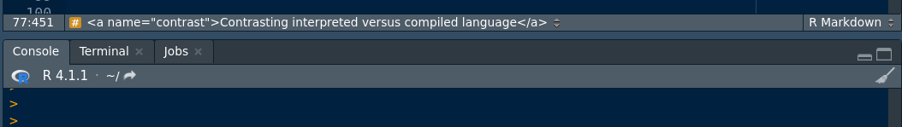
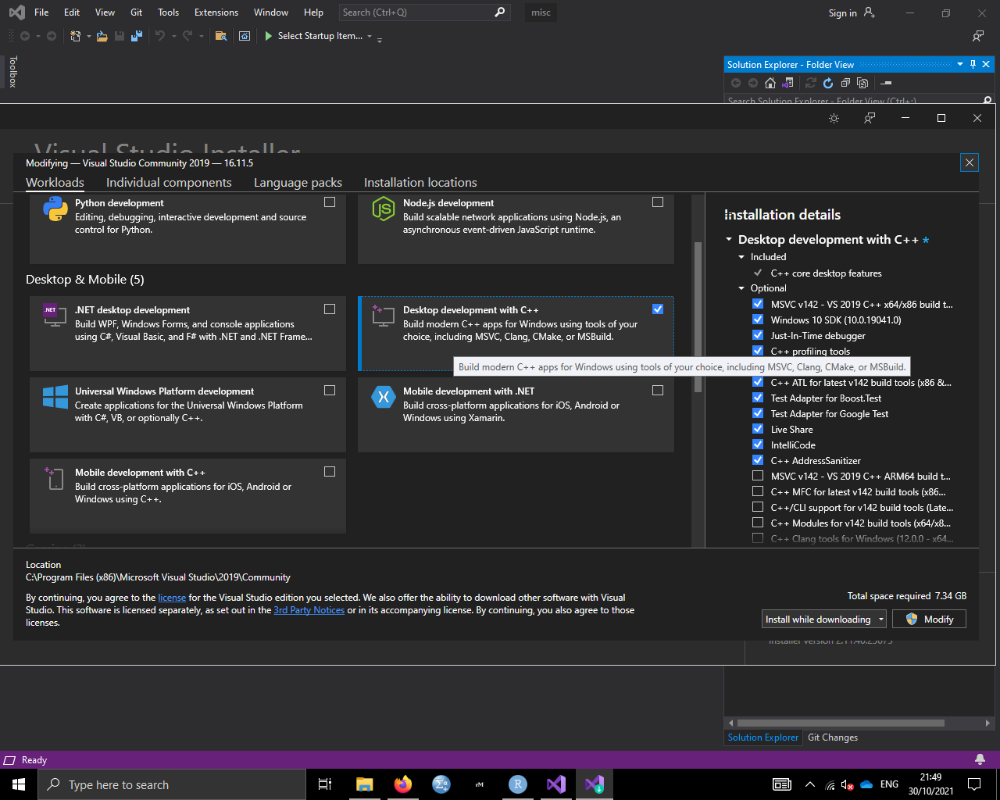
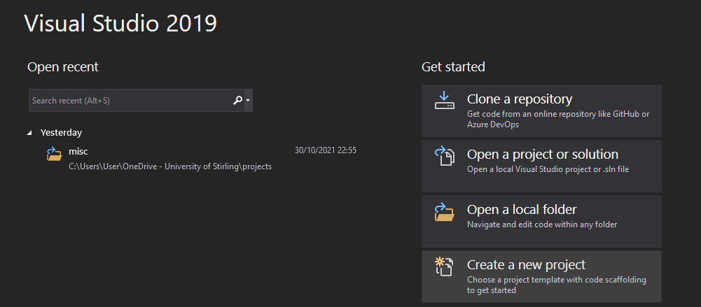
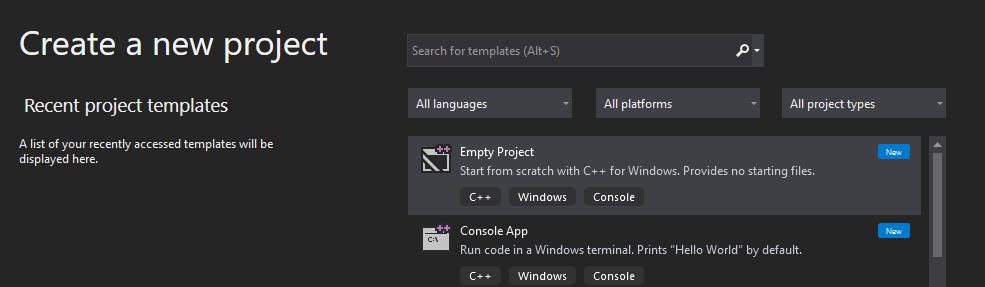
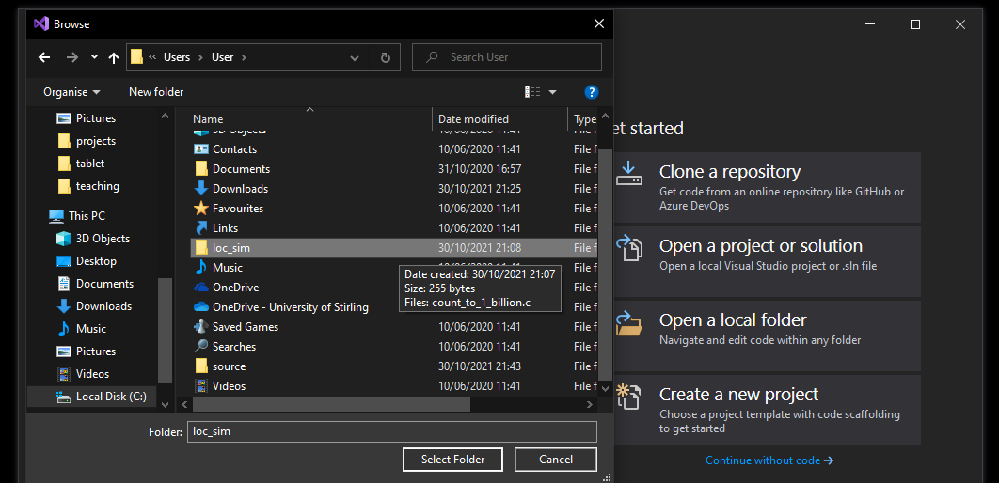
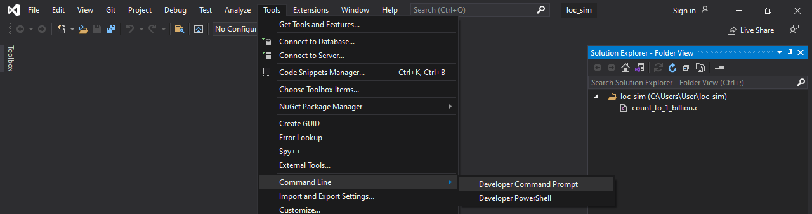
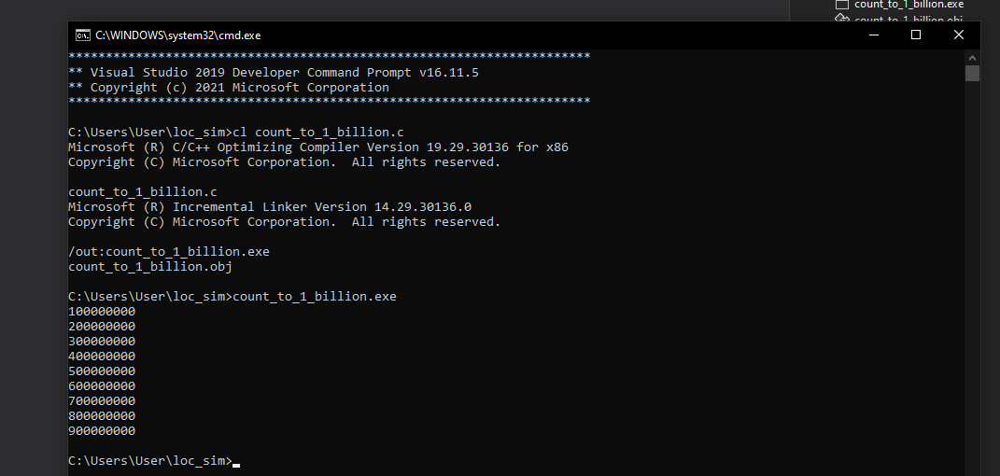
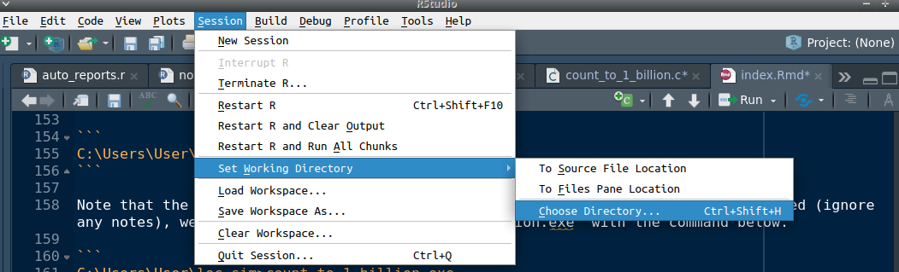

Contents
================================================================================

- [Introduction: Objective of these notes](#intro)
- [Contrasting interpreted versus compiled language](#contrast) 
- [More R code to help get started](#Rcode)


<a name="intro">Introduction: Objectives of these notes</a>
================================================================================

The focus of the synchronous coding club meeting this week is on general computing concepts. These notes will stray a bit from that focus because I want to introduce some R code that I did not last week. Hence, these notes will include two distinct topics. The first topic will be contrasting coding and code performance in an interpreted language (R) versus a compiled language (C). The second topic will be picking up where we left off [last week](https://stirlingcodingclub.github.io/getting_started/notes.html) with the introduction to R programming. My hope is that there will be a bit of something for everyone in these notes, including novices to coding and more advanced R users. If you are just getting started, then it might make sense to skip the section [contrasting interpreted versus compiled language](#contrast) and move right to where we left off last week with [more R code to help get started](#Rcode).

<a name="contrast">Contrasting interpreted versus compiled language</a>
================================================================================

Almost all coding is done using source code; that is, code that can be read and understood by a human. To actually run the code, we need to convert the source code into a binary format (ones and zeroes) that can be read by the computer. To do this conversion, we can either *compile* the code or *interpret* it. Technically speaking, any code *could* be compiled or interpreted, but most programming languages are associated with one or the other method. 

When compiling code, the source code is translated beforehand into a form that the computer can read more easily. Only after this translation occurs is the code actually run, so the process of running code occurs in two steps (compile, then run). The benefit of compiled code is that it can generally run much faster (orders of magnitude faster); the cost is that writing compiled code is slower, more laborious, and often more frustrating. Code that takes me 2-5 minutes in an interpreted language such as R could easily take 30-60 minutes in a compiled language such as C. But if the compiled code can finish running in minutes or hours rather than days to weeks, then it might be worth the hassle.

When running interpreted code, individual chunks of code are run bit by bit through an interpreter. This interpreter breaks down the code and executes it on the fly, so everything is done in one step (e.g., in R, there is no compile then run -- you just run the code in the console after you have written it). The cost of this method is that the interpreted code can be much slower. The benefit is that the actual process of writing code is generally faster and more intuitive. For many tasks, speed is also not worry, so there is little if any downside to avoiding the compiler.

In all types of code, binary instructions (compiled or interpreted) are sent to the computer's Central Processing Unit (CPU). What the CPU does with these instructions is actually quite limited; it can read and write to memory, and do some basic arithmetic. All of the instructions that you type in your source code essentially boil down to these tasks. The memory (specifically, 'random-access memory', or RAM) is separate from the CPU; it holds data that can be read and changed. The data exist as binary units (ones and zeroes), which are grouped in chunks of eight to make one 'byte'. In relatively 'high level' programming languages (e.g., R, MATLAB, python), you can more or less avoid thinking about all of this because the code is abstracted away from the nuts and bolts of the computer hardware and the management of memory is done behind the scenes. In more 'low level' programming languages (e.g., C, FORTRAN, COBOL), you will need to be explicit about how your code uses the computer's memory.

Let's start by running a very simple script of code, first in an interpreted language (R), and then in a compiled language (C). The code we write will count from one to one billion, printing every 100 millionth number. Here is what the code looks like in R.

```{r, eval = FALSE}
count_to_1_billion <- function(){
    for(i in 1:1000000000){
        if(i %% 100000000 == 0){
          print(i);
        }  
    }
    return("Done!");
}
```

You can also find the Rscript with the code above [on GitHub](https://github.com/StirlingCodingClub/coding_types/blob/main/count_to_1_billion.R). Note that the above code defines a function and includes a `for` loop. We will get to what these are doing in a later workshop, but for now, all that you need to do is highlight the code above and run it in the console. This will define the function. To run the function, you can then type the following line of code in the console.

```{r, eval = FALSE}
count_to_1_billion();
```

Note, this might take a while! While you are waiting, you can create a new script for the compiled version written in C. To do this, you can either download [this file](https://github.com/StirlingCodingClub/coding_types/blob/main/count_to_1_billion.c) from GitHub or create a new script in Rstudio and paste the following code.

```{c, eval = FALSE}
# include<stdio.h>

int main(void){

    long i;

    for(i = 1; i < 1000000000; i++){
       if(i % 100000000 == 0){
           printf("%lu\n", i);
       }
    }
    return 0;
}
```

Once pasted, save the file as `count_to_1_billion.c` (remember where you save it). If you get a box that pops up asking "Are you sure you want to change the type of the file so that it is no longer an R script?", then click "Yes". Note that you could have also pasted the code into a text editor such as notepad or gedit instead of Rstudio (but *not* in a word processor such as MS Word).

Now we need to compile the code. How you do this depends on the operating system that you use (Mac, Linux, or Windows). I will first show how to compile and run for Mac and Linux, then how to compile and run for Windows. 

**Mac and Linux Users**

On Mac or Linux, you need to first open a terminal. You can do this by finding an external one on your computer (e.g., do a search for 'terminal', and one should be available), or by using the 'Terminal' tab right within Rstudio (see the middle tab below). Note that this Rstudio terminal is also available on a browser through [Rstudio cloud](https://rstudio.cloud), so you can use the Rstudio cloud to do the whole exercise (just make sure you upload the C file).

```{r, fig.alt = "Rstudio screenshot showing Console, Terminal, and Jobs tabs", out.width="100%", echo = FALSE}

```

Once you are in the terminal, you need to make sure to get to the correct directory. The directory will be in the same location as where you stored your `count_to_1_billion.c` file. To navigate to the correct directory, we need to use the change directory `cd` command in the terminal. In my case, I have saved `count_to_1_billion.c` to a folder called 'loc_sim' on my computer, so I will navigate to that folder with the command below, typing `cd loc_sim` (hint `cd ..` moves you up a directory, if you ever need it) followed by the 'Enter' key.

```
brad@brad-HP:~$ cd loc_sim
```

This puts me in the loc_sim directory. If I want to view the contents of this directory, I can type `ls`.

```
brad@brad-HP:~/loc_sim$ ls
count_to_1_billion.c
```

Now I need to compile code. To do this, I will run the gcc compiler and the following command.

```
brad@brad-HP:~/loc_sim$ gcc -Wall count_to_1_billion.c -o count_to_1_billion
```

The gcc compiler should be on most Linux and Mac computers. The `-Wall` above tells the compiler to give us warnings if necessary, and the rest of the code tells us to use the `count_to_1_billion.c` file to build the program `count_to_1_billion`. If there are no warnings, then the compiler should execute, and the new program should show up in my 'loc_sim' folder. To run it, I can use the following code.

```
./count_to_1_billion
```

Notice the amount of time that took when compared to the equivalent R code. 

**Windows users**

As with Mac and Linux users, you first need to open a terminal. Unfortunately, to access a compiler, you will need to download some new tools. Microsoft windows does not actually come with a pre-installed compiler for its command prompt, so we first need to download one form [Visual Studio](https://visualstudio.microsoft.com/downloads/). Use the link to go to their page and download the 'Visual Studio' Community version (free for students, open-source contributors, and individuals). The most recent one at the time of writing is 'Visual Studio 2019'. You will need to download and install this onto your machine. After Visual Studio is successfully installed, then you will also need to install a Workload called 'Desktop development with C++' (see below).

```{r, fig.alt = "Microsoft Visual Studio interface is shown with options to download Desktop development with C++", echo = FALSE}
;
```

I might also recommend installing the Linux tools as well (scroll down to find these). Once these are downloaded, then you can go into Visual Studio and create a new project.

```{r, fig.alt = "Microsoft Visual Studio interface is shown with a menu to get started that includes 'Create a new project'", echo = FALSE}
;
```

From that new project, you can choose the 'Empty Project' option to start from scratch.

```{r, fig.alt = "Microsoft Visual Studio interface is shown with a menu to get started that includes 'Create a new project'", echo = FALSE}
;
```

Browse through your files and find the repository where the `count_to_1_billion.c` file was saved (mine is in 'loc_sim', as shown below). Select the folder.

```{r, fig.alt = "Microsoft Visual Studio interface is shown with a browse menu open and the folder 'loc_sim' selected.", echo = FALSE}
;
```

After this folder is selected, we can open a command line within Visual Studio by going to 'Tools > Command Line > Developer Command Prompt'. 

```{r, fig.alt = "Microsoft Visual Studio interface is shown with a toolbar open and navigating to the Developer Command Prompt.", echo = FALSE}
;
```

Once in the command prompt, we can use the `DIR` command to confirm that we are in the correct directory with the `count_to_1_billion.c` file 

```
C:\Users\User\loc_sim>DIR
```

We can now finally type the command to compile the code.

```
C:\Users\User\loc_sim>cl -Wall count_to_1_billion.c
```

Note that the command here is different from the Mac and Linux command. Once compiled (ignore any notes), we can run the program 'count_to_1_billion.exe' with the command below.

```
C:\Users\User\loc_sim>count_to_1_billion.exe
```

This should produce an output like the one shown below.

```{r, fig.alt = "Microsoft Visual Studio interface is shown with the program 'count_to_1_billion.exe' being compiled, then run.", echo = FALSE}
;
```

There are other ways to compile and run C code in Windows, but as far as I am aware, this is the most straightforward. Note the contrast in the process of running the interpreted (R) versus compiled (C) code, and the time that it took to run each. If you have made it this far, then you should have the basic tools that you need to run compiled code in C. In the following section, we will look at some more R code. 


<a name = "Rcode">More R code to help get started</a>
================================================================================

As mentioned earlier, I want to pick up where [the last session](https://stirlingcodingclub.github.io/getting_started/notes.html) left off with some useful things to know about coding in R. This is not in any way a comprehensive list of things to know before you start to program in R. What I want to do is provide some additional tips for getting started, mainly things that I learned (or wish I had learned) when first learning to code in R. In [the last session](https://stirlingcodingclub.github.io/getting_started/notes.html), I introduced some coding ideas and functions for getting started with basic statistical tools (functions introduced last time were `read.csv`, `head`, `dim`, `hist`, `summary`, `plot`, `cor.test`, `lm`, `t.test`, and `aov`). Here I will focus more on data wrangling (i.e., cleaning and transforming data). We can start by loading the same Bumpus sparrow data set from last time, which you can download [here](https://github.com/StirlingCodingClub/coding_types) (right click 'Bumpus_data.csv' and save) or [here](https://www.dropbox.com/s/lgeyldur1kyt65x/Bumpus_data.csv?dl=0). Make sure that you are in the correct working directory  before getting started (i.e., the directory where the Bumpus data file is located). If you need to change directories, you can go to the Rstudio toolbar and select 'Session > Set Working Directory > Choose Directory' and select the directory.

```{r, fig.alt = "Rstudio interface showing how to choose a directory from the Rstudio toolbar", echo = FALSE}
;
```

We can also select the working directory directly from the command line.

```{r, eval = FALSE, echo = TRUE}
setwd("~/Dropbox/projects/StirlingCodingClub/coding_types");
```

Note that your own path will look different than mine, especially if you are running Windows. From here, we can read in the Bumpus CSV file and assign it to the variable named `dat`.

```{r, echo = TRUE}
dat <- read.csv(file = "Bumpus_data.csv", header = TRUE);
```

We now have our data set read into R. We can confirm that everything looks good by inspecting the first six rows of the dataset using the `head` function (note, the equivalent function `tail` gives us the last six rows).

```{r, echo = TRUE}
head(dat);
```

What we are looking at now is a data frame. Visually, this is a two-dimensional table of data that includes columns of various types (in this case, words and numbers). It is completely fine to think about the data frame this way, but the way that R sees the data frame is as an ordered list of vectors, with each vector having the same number of elements. I will create a smaller one to demonstrate what I mean.

```{r, echo = TRUE}
eg_list <- list(A = c("X", "Y", "Z"), B = c(1, 2, 3), C = c(0.3, 0.5, -0.2));
eg_list;
```

Notice that the list that I created above includes three elements, which I have named 'A', 'B', and 'C'. Each of these elements is a vector of length three (e.g., the first element 'A' is a vector that includes "X", "Y", and "Z"). The whole list is called `eg_list`, but if I wanted to just pick out the first vector, I could do so with the `$` sign as below.

```{r, echo = TRUE}
eg_list$A;
```

Notice how only the first list element (vector with "X", "Y", and "Z") is printed. Somewhat confusingly there are at least two other ways to get at this first list element. The notation for identifying list elements is to enclose them in two square brackets, so if I just wanted to pull the first element of `eg_list`, I could also have typed the below to get an identical result.

```{r, echo = TRUE}
eg_list[[1]];
```

Since the first element of the list is named 'A', both `eg_list$A` and `eg_list[[1]]` give the same output. There is a third option, `eg_list[["A"]]`, which is a bit more to type, but is also more stable than the `$` because `$` allows for partial matching (e.g., if a list element was named 'December', then 'Dec' would work, but be careful if you have another list element that starts with 'Dec'!).

```{r, echo = TRUE}
eg_list[["A"]];
```

If we want to get individal vector elements of our list elements, we use a single square bracket. That is, say we wanted to just pick out the second element "Y" in the list element "A". We could do so with the following code.

```{r, echo = TRUE}
eg_list[["A"]][2];
```

Note that `eg_list$A[2]` or `eg_list[[1]][2]` would also work just fine. Lists are very flexible in R, and you can even have lists within lists, which could make the notation quite messy (e.g., `eg_list[[1]][[1]][2]` for the second element of the first list in the first list -- I don't generally recommend structuring data in this way unless you absolutely need to for some reason). In any case, it is helpful to know sometimes that when we are reading in and working with data frames, we are really just looking at lists of equal vector lengths. We can even turn our `eg_list` into a two-dimensional data frame that looks like the `dat` Bumpus data that we read in earlier. 

```{r, echo = TRUE}
as.data.frame(x = eg_list);
```

See in the above how each element name became the column name above. Let's take another look at the `dat` data frame again.

```{r}
head(dat);
```


Note now that we can refer to each column in the same way that we referred to list elements (note, we could also put `dat` in list form with `as.list(dat)`). So if we just wanted to look at `wgt`, then we could type `dat$wgt`, `dat[["wgt"]]`, or `dat[[5]]`. Because R recognises the data frame as having two dimensions, we could also type the below to get all of the `wgt` values in the fifth column.

```{r}
dat[,5];
```

Note that the square brackets above identify the row and column to select in `dat`. Empty values are interpreted as 'select all', meaning that `dat[,]` is the same as writing `dat` -- both select the entire data set. To select, e.g., only the first five columns of data, we could use `dat[,1:5]` (recall that `1:5` produces the sequence of integers, `1, 2, 3, 4, 5`). If instead we wanted to select the first three rows, then we could use `dat[1:3, ]`. And if we wanted only the first three rows and first five columns, we could use `dat[1:3, 1:5]`. The point is that the numbers listed within the square brackets refer to the rows and columns of the data frame, and we can use this to manipulate the data. 

Here is a simple example. In this data set, the last five columns are measured in inches (all of the other length measurements are in mm). Assume that we wanted to put them into mm to match the 'totlen', 'wingext', and 'head' measurements. We just need to then multiply all of the values in the last five columns (columns 7-11) by 25.4 (1 inch equals 25.4 mm). We could do this column by column. For example, to multiply all of the values in the seventh column `humer`, we could use the following code.

```{r}
dat[["humer"]] <- dat[["humer"]] * 25.4;
```

Verbally, what I have done above is to assign `dat[["humer"]]` to a new value of `dat[["humer"]] * 25.4` -- that is, I have multiplied the column `dat[["humer"]]` by 25.4 and inserted the result back into the `dat` array. A short-cut for doing the rest of them all at once (columns 8-11) is below.

```{r}
dat[,8:11] <- dat[,8:11] * 25.4;
```

I am mixing and matching the notation a bit just to get you used to seeing a couple different versions (as a side note, R allows us to assign in both directions, so we could have also typed `dat[,8:11] * 25.4 -> dat[,8:11];`, though it is very rare to do it this way). Now we should have a data set with the last five columns in mm rather than inches.

```{r}
head(dat);
```

Maybe we want to save this data set as a CSV file. To do so, we can use the `write.csv` function as below.

```{r}
write.csv(x = dat, file = "Bumpus_data_mm.csv", row.names = FALSE);
```

There will now be a new file 'Bumpus_data_mm.csv' in the working directory with the changes that we made to it (converting inches to mm). Note my use of the argument `row.names = FALSE`. This is just because the `write.csv` function, somewhat annoyingly, will otherwise assume that we want to insert a first column of row names, which will show up as integer values (i.e., a new first column with the sequence, 1, 2, 3, ..., 136).

Now that you have a handle on how to refer to rows, columns, and individual values of a data set, I will introduce some functions in R that might be useful for managing data. If at any time we want to look at what objects we have available in Rstudio, then we can use the `ls` function below.

```{r}
ls();
```

The above output should make sense because we have assigned `dat` and `eg_list`. Now say we want to get rid of the `eg_list` that I assigned. We can remove it using the `rm` function.

```{r}
rm(eg_list);
```

The `eg_list` should now be removed from R and not appear anymore if I type `ls()`.

```{r}
ls();
```

Now let's look more at `dat`. Let's say that I want to find out about the attributes of this object. I can use the `attributes` function to learn more.

```{r}
attributes(dat);
```

You can now see the names (column names, which recall are also vector element names), row names, and the class of the object. Note that not all objects will have the same (or indeed any) attributes. But the attributes that we can see gives us a bit of information, and we can actually refer to the attributes themselves with the equivalently named `names`, `row.names`, and `class` functions. For example, if we wanted to get all of the names of dat, we could use the code below.

```{r}
names(dat);
```

The same would work for `row.names` and `class`. We can also pull out information for individual columns of data. If, for example, we wanted a quick count of the alive versus dead individual sparrows in the data set, we could use the `table` function.

```{r}
table(dat$surv);
```

If we wanted the set of unique `totlen` values, then we could use the `unique` function.

```{r}
unique(dat$totlen);
```

Let's say that we wanted to know if a sparrow has total length greater than 160. We could use the code below to get a TRUE/FALSE vector for which 'TRUE' indicates a length over 160 and a 'FALSE' indicates a length of 160 or less.

```{r}
dat$totlen > 160;
```

The above looks a bit messy, but it can be quite useful if we also know that R interprets `TRUE` as having a value of 1, and `FALSE` as having a value of `0`. We can actually get R to confirm this itself, e.g., by checking if `FALSE == 1`.

```{r}
FALSE == 1;
```

It does not. But now we can check if `FALSE == 0`.

```{r}
FALSE == 0;
```

We could do the same for `TRUE` and confirm that `TRUE == 1`. Since `TRUE` is equivalent to 1 and `FALSE` is equivalent to 0, a numeric version of the `TRUE/FALSE` vector above would look like the below.

```{r}
as.numeric(dat$totlen > 160);
```

Compare the above to the equivalent `TRUE/FALSE` vector to confirm that they are the same. We can use this to our advantage to count all of the sparrows whose length exceeds 160.

```{r}
sum(dat$totlen > 160);
```

Note that what we have done is produce that same `TRUE/FALSE` vector as above, but then summed up all the values. Because `TRUE` values are 1 and `FALSE` values are 0, the number of `TRUE` values get counted up. We can do multiple comparisons though too. Say that we wanted to find out the number of individuals that have a total length either greater than 160 mm or less than or equal to 155 mm. We could make this work using the 'or' operator, represented in R by a vertical line `|`.

```{r}
sum(dat$totlen > 160 | dat$totlen <= 155);
```

Notice how the `|` separates the two comparisons, and the `<=` sign is used to indicate 'less than or equals to' (a `>=` would indicate 'greater than or equal to, and `==` is simply 'equal to', as we saw above).

We could also try to pull out a subset of individuals who have a total length greater than 160 mm and are female. We could make this work using the 'and' operator, represented by an ampersand in R, `&`.

```{r}
sum(dat$totlen > 160 & dat$sex == "female");
```

Notice how the `&` separates the two comparisons and "female" is placed in quotes (else R will look for an object called 'female' and come up empty with an error message -- try this out!).

Now say we wanted to identify the row numbers of the individuals with a total length above 165 mm. We could first find these individuals and assign their rows to a new variable using the `which` function.

```{r}
inds_gt_165 <- which(dat$totlen > 165);
inds_gt_165;
```

Now that we have these rows of individuals with a total length above 165 mm, we could use these values in `inds_gt165` to view just these rows of the `dat` data frame.

```{r}
dat[inds_gt_165,];
```

Notice how the values of `totlen` are all above 165, and the row numbers to the left match the values in `inds_gt_165`. One more quick trick -- say that we wanted to check if a living individual was in this subset (obviously we can see that the first one is alive, but pretend for a moment that the data frame was much larger). We could use the `%in%` operator to check.

```{r}
"alive" %in% dat$surv;
```

Again, note how 'alive' is placed in quotes. We could also check to see if numeric values are in the data set. For example, we could ask if the value '250' appears anywhere in `dat$wingext`.

```{r}
250 %in% dat$wingext;
```

Next, I want to demonstrate three useful functions in R, `tapply`, `apply`, and `lapply`. All of these functions essentially apply some other function across an array, table, or list. Say that we want to find the means of females and males in the data set. We could do this with the `tapply` function.

```{r}
tapply(X = dat$totlen, INDEX = dat$sex, FUN = mean);
```

Note that in the above, the argument `X` is what we want to do the calculations across (total length), `INDEX` does the calculation for each unique element in the vector (i.e., 'female' and 'male' in `dat$sex`), and `FUN` indicates the function ('mean' in this case, but we could do 'sd', 'length', 'sum', or any other calculation that we want). We could use all of this to calculate, e.g., the standard error of females and males.

```{r}
N_dat  <- tapply(X = dat$totlen, INDEX = dat$sex, FUN = length);
SD_dat <- tapply(X = dat$totlen, INDEX = dat$sex, FUN = sd);
SE_dat <- SD_dat / sqrt(N_dat);
SE_dat;
```

The function `lapply` works similarly, but over lists. We can remake that example list from earlier. 

```{r, echo = TRUE}
eg_list <- list(A = c("X", "Y", "Z"), B = c(1, 2, 3), C = c(0.3, 0.5, -0.2));
eg_list;
```

If we wanted to confirm the length of each of the three list elements, we could do so with `lapply`.

```{r}
lapply(X = eg_list, FUN = length);
```

We can try to use a function like 'mean' too, but note that we cannot get the mean of "X", "Y", and "Z", as this does not make any sense. If we try to do it, then R will give us an answer of `NA` for the first element with a warning, then calculate the means of the numeric elements.

```{r}
lapply(X = eg_list, FUN = mean);
```

Finally, the function `apply` works similarly on arrays of numbers. That is, we need to have an object with two (or more) dimensions in which every element is a number. To get an example, we can just use the last nine columns of `dat` (i.e., everything except `sex` and `surv`). We can define this below in a new object.

```{r}
dat_array <- dat[,3:11];
head(dat_array);
```

Now say that we wanted to get the mean value of every column. We could go through individually and find `mean(dat_array$totlen)`, `mean(dat_array$wingext)`, etc., or we could use `apply`.

```{r}
apply(X = dat_array, MARGIN = 2, FUN = mean);
```

The `MARGIN` argument is the only different one from `lapply` and `tapply`, and it is a bit confusing at first. It states the dimension over which the function will be applied, with 1 representing rows and 2 representing columns. This makes more sense when you consider that numeric arrays (unlike data frames) can have any number of dimensions. For example, consider this three dimensional array.

```{r}
eg_array <- array(data = 1:64, dim = c(4, 4, 4));
eg_array;
```

See how the array has four rows, four columns, and four different layers. Now if we wanted to pull out, e.g., the first row and second column of the fourth layer, we could do so with square brackets as below.

```{r}
eg_array[1, 2, 4];
```

We could also use `apply` across the third dimension (which I've been calling 'layer') to get the mean of each.

```{r}
apply(X = eg_array, MARGIN = 3, FUN = mean);
```

We could even get the mean column value *for each layer* with the somewhat confusing notation below.

```{r}
apply(X = eg_array, MARGIN = c(1, 3), FUN = mean);
```

You will probably never need to actually do this, but it is possible. To read the above, note that the each row represents a layer in the original `eg_array`, and each column represents a row of that layer. So, e.g., the mean of 1, 5, 9, and 13 is 7; the mean of 2, 6, 10, and 14 is 8, and so forth. Moving onto the next layer, the mean of 17, 21, 25, and 29 is 23. Again, you will almost never need to do this, but it can be useful if you are working with multidimensional arrays. 

There are a lot more tips and tricks that I could potentially introduce here, but I will leave it to you to explore a bit. In the next session, we will look at out to write custom R functions, followed by how to use loops in R. Both of these topics are extremely useful for R coding.


