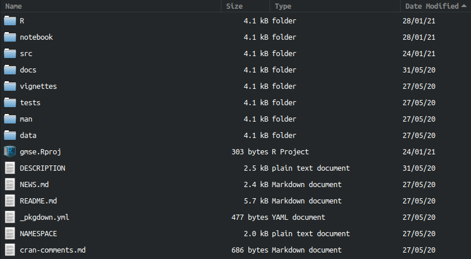
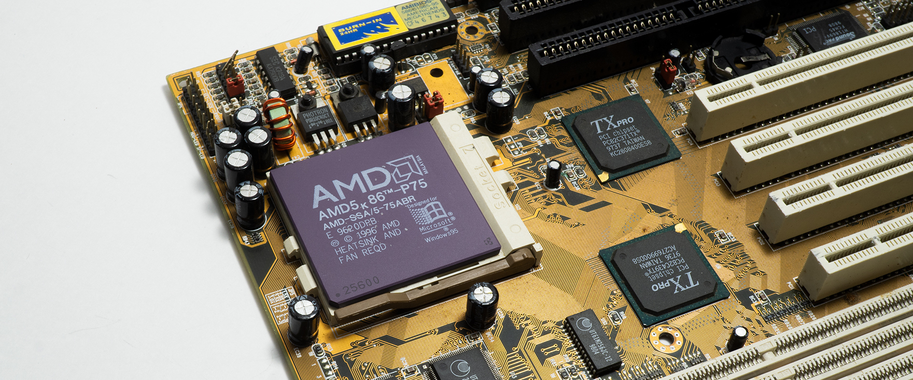
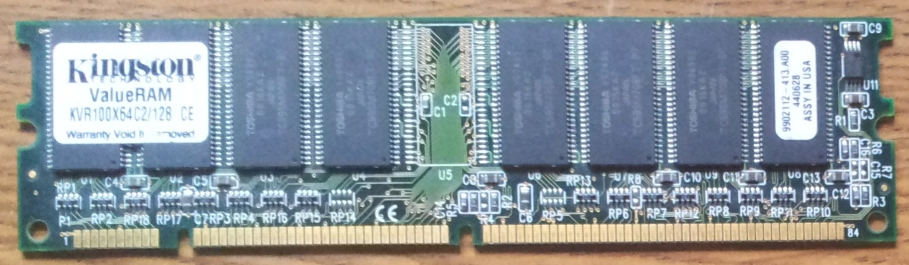
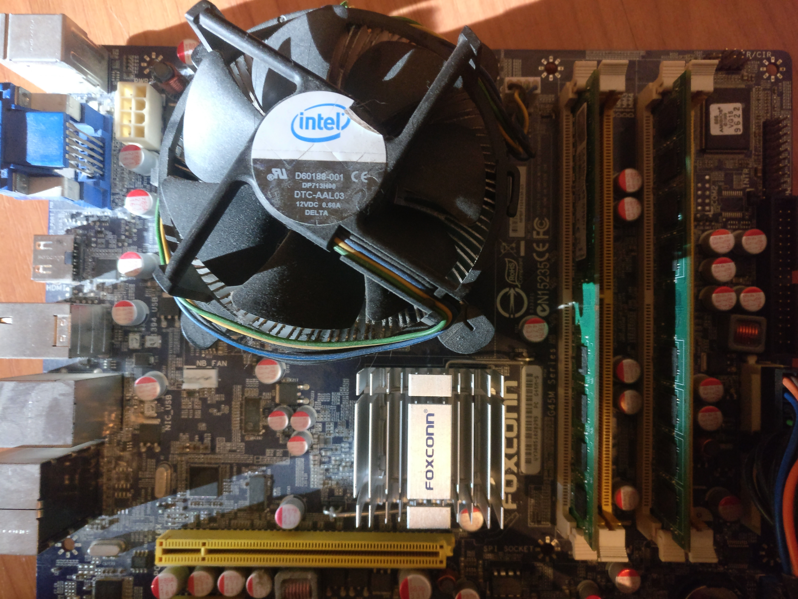

## How does code actually work?

\begin{itemize}
\item Programmers work with \textbf{source code} (e.g., R, python)
\item Computers execute \textbf{machine language} (binary)
\item To get from source code to machine language, we can \textit{compile} code or \textit{interpret} it.
\end{itemize}


## Compiled versus interpreted code

\begin{columns}
\begin{column}{0.5\textwidth}
\vspace{4mm}

\textbf{Compiled code}
\vspace{2mm}
\begin{itemize}
\item Directly translates everything to machine language
\item Translation must occur before running code
\item C, C++, FORTRAN, Pascal (low-level languages)$^{1}$
\item Two steps to execute code
\item Faster performance (executes immediately after compiling)
\item Slower and more laborious to code \pause
\end{itemize}


\end{column}
\begin{column}{0.5\textwidth} 

\textbf{Interpreted code}

\begin{itemize}
\item Code is run bit by bit through an interpreter
\item Interpreter breaks down and executes code `on the fly'
\item R, Perl, MATLAB, Python (high-level languages)$^{1}$
\item One step to execute code
\item Slower performance (executes after interpreted)
\item Faster and more intuitive to code
\end{itemize}

\end{column}
\end{columns}
\pause


\footnotetext[1]{Technically, any language \textit{could} be compiled or interpreted.}


## R packages can include both compiled and intereted code




## R packages can include both compiled and intereted code {.smaller}

\footnotesize

**An R file named `resource.R'**

```{r, eval = FALSE}
run_resource <- function(RESOURCE_c, LANDSCAPE_c, PARAMETERS_c){
    .Call("resource", RESOURCE_c, LANDSCAPE_c, PARAMETERS_c);
}
```

\vspace{3mm} \pause

**A C file named `resource.c'**

```
SEXP resource(SEXP RESOURCE, SEXP LANDSCAPE, SEXP PARAMETERS){
 
    /* SOME STANDARD DECLARATIONS OF KEY VARIABLES, POINTERS   */
    /* ======================================================= */
    int xloc, yloc;     /* x and y locs in the RESOURCE array  */ 
    int land_x, land_y; /* x and y maximum loc given LANDSCAPE */
    int zloc, land_z;   /* z locations                         */
    int resource;       /* Index for resource (rows RESOURCE)  */
    int resource_new;   /* Index for resource in new array     */
    int trait;          /* Index for resource traits           */
    int res_number;     /* Resources included (default = 1)    */
```


\normalsize

## The role of the processor

\begin{itemize}
\item Machine code: list of instructions written in binary (1s \& 0s)
\item Binary instructions sent to the \textit{Central Processing Unit (CPU)}
\begin{itemize}
\item CPUs read \& write to memory, and do maths (that's it)
\item Instructions tell CPU to read \& write information to memory
\end{itemize} 
\end{itemize} 


\footnotetext[1]{\textbf{Image:} Public domain}


## The role of memory

\begin{itemize}
\item Random-access memory (RAM, or just `memory') is separate from the CPU, and holds data that can be read and changed
\begin{itemize}
\item Memory exists as binary digits (`bits') of ones and zeros
\item Bits are grouped in chunks of eight to make one `byte': \textit{Unit of data storage large enough to hold any basic character}.
\end{itemize}
\end{itemize}




##




## Thinking about computer memory

In R, memory is allocated automatically when we assign values.

```{r, eval = FALSE}
array_1 <- 1:6; # Assign 'array_1' values 1 through 6
```


\vspace{2mm} \pause

In C, memory needs to be allocated to a memory location.

\footnotesize

| Location 1 | Location 2 | Location 3 | Location 4 | Location 5 | Location 6 |
|------------|------------|------------|------------|------------|------------|
| 0x7fc010   |  0x7fc011  | 0x7fc012   |  0x7fc013  | 0x7fc014   |  0x7fc015  |


\normalsize \pause

The `0x` indicates hexidecimal, but we can translate to decimal.

\footnotesize

| Location 1 | Location 2 | Location 3 | Location 4 | Location 5 | Location 6 |
|------------|------------|------------|------------|------------|------------|
|  8372240   |  8372241   |  8372242   |  8372243   |  8372244   |  8372245   |

\pause

```{c, eval = FALSE}
array_1 = malloc(6 * sizeof(double));
```


## Thinking about computer memory


|         |  Column 2  | Column 3   | Column 4   | 
|---------|------------|------------|------------|
| Row 1   |  3         | 5          |  4         |
| Row 2   |  1         | 7          |  6         |


\pause
\vspace{8mm}

```{r, echo = FALSE}
print(as.array(matrix(data = c(3, 5, 4, 1, 7, 6), nrow = 2, byrow = TRUE)));
```


## Thinking about computer memory

```{r, echo=FALSE, fig.height=4, fig.width=6}
mbox <- function(x0, x1, y0, y1){
    xx <- seq(from=x0, to=x1, length.out = 100);
    yy <- seq(from=y0, to=y1, length.out = 100);
    xd <- c(rep(x0, 100), xx, rep(x1,100), rev(xx));
    yd <- c(yy, rep(y1,100), rev(yy), rep(y0, 100));
    return(list(x=xd, y=yd));
}
par(mar=c(0,0,0,0));
# ===============================================================
plot(x=0, y=0, type="n", xlim=c(0,200), ylim=c(35,100), xaxt="n", yaxt="n",
     xlab="",ylab="");

text(x=0, y=93, labels="Pointer to pointer (**array2D)", col="black", pos = 4);
abox <- mbox(x0 = 0, x1 = 190, y0 = 70, y1 = 90);
polygon(x=abox$x, y=abox$y, lwd=3, border="black", col="grey70");
a1box <- mbox(x0 = 2, x1 = 88, y0 = 81, y1 = 89);
polygon(x=a1box$x, y=a1box$y, lwd=2, border="black", col="grey90");
a2box <- mbox(x0 = 2, x1 = 88, y0 = 71, y1 = 79);
polygon(x=a2box$x, y=a2box$y, lwd=2, border="black", col="grey90");
text(x=1, y=84.5, labels="Address: 7ffef08a8978", col="black", pos=4);
text(x=1, y=74.5, labels="Value: 150b010", col="black", pos = 4);

a3box <- mbox(x0 = 102, x1 = 188, y0 = 81, y1 = 89);
polygon(x=a3box$x, y=a3box$y, lwd=2, border="black", col="grey90");
a4box <- mbox(x0 = 102, x1 = 188, y0 = 71, y1 = 79);
polygon(x=a4box$x, y=a4box$y, lwd=2, border="black", col="grey90");
text(x=103, y=84.5, labels="Address: 7ffef08a8979", col="black", pos=4);
text(x=103, y=74.5, labels="Value: 150b013", col="black", pos = 4);

text(x=32, y=63, labels="Addresses and values", col="black", pos = 4);
bbox <- mbox(x0 = 0, x1 = 190, y0 = 40, y1 = 60);
polygon(x=bbox$x, y=bbox$y, lwd=3, border="black", col="grey70");
b1   <- mbox(x0 =   4, x1 =  33, y0 = 51, y1 = 59);
b2   <- mbox(x0 =  34, x1 =  63, y0 = 51, y1 = 59);
b3   <- mbox(x0 =  64, x1 =  93, y0 = 51, y1 = 59);
b4   <- mbox(x0 =  96, x1 = 125, y0 = 51, y1 = 59);
b5   <- mbox(x0 = 126, x1 = 155, y0 = 51, y1 = 59);
b6   <- mbox(x0 = 156, x1 = 185, y0 = 51, y1 = 59);
polygon(x=b1$x, y=b1$y, lwd=2, border="black", col="grey90");
polygon(x=b2$x, y=b2$y, lwd=2, border="black", col="grey90");
polygon(x=b3$x, y=b3$y, lwd=2, border="black", col="grey90");
polygon(x=b4$x, y=b4$y, lwd=2, border="black", col="grey90");
polygon(x=b5$x, y=b5$y, lwd=2, border="black", col="grey90");
polygon(x=b6$x, y=b6$y, lwd=2, border="black", col="grey90");
text(x=  4, y=54.5, labels="150b010", col="black", pos=4);
text(x= 34, y=54.5, labels="150b011", col="black", pos=4);
text(x= 64, y=54.5, labels="150b012", col="black", pos=4);
text(x= 94, y=54.5, labels="150b013", col="black", pos=4);
text(x=124, y=54.5, labels="150b014", col="black", pos=4);
text(x=154, y=54.5, labels="150b015", col="black", pos=4);

arrows(x0=30, x1=20, y0=72, y1=58, lwd=2, length=0.15);
arrows(x0=135, x1=110, y0=72, y1=58, lwd=2, length=0.15);

c1   <- mbox(x0 =   4, x1 =  33, y0 = 41, y1 = 49);
c2   <- mbox(x0 =  34, x1 =  63, y0 = 41, y1 = 49);
c3   <- mbox(x0 =  64, x1 =  93, y0 = 41, y1 = 49);
c4   <- mbox(x0 =  96, x1 = 125, y0 = 41, y1 = 49);
c5   <- mbox(x0 = 126, x1 = 155, y0 = 41, y1 = 49);
c6   <- mbox(x0 = 156, x1 = 185, y0 = 41, y1 = 49);
polygon(x=c1$x, y=c1$y, lwd=2, border="black", col="grey90");
polygon(x=c2$x, y=c2$y, lwd=2, border="black", col="grey90");
polygon(x=c3$x, y=c3$y, lwd=2, border="black", col="grey90");
polygon(x=c4$x, y=c4$y, lwd=2, border="black", col="grey90");
polygon(x=c5$x, y=c5$y, lwd=2, border="black", col="grey90");
polygon(x=c6$x, y=c6$y, lwd=2, border="black", col="grey90");
text(x=  8, y=44.5, labels="3", col="black", pos=4);
text(x= 38, y=44.5, labels="5", col="black", pos=4);
text(x= 68, y=44.5, labels="4", col="black", pos=4);
text(x= 98, y=44.5, labels="1", col="black", pos=4);
text(x=128, y=44.5, labels="7", col="black", pos=4);
text(x=158, y=44.5, labels="6", col="black", pos=4);
```


